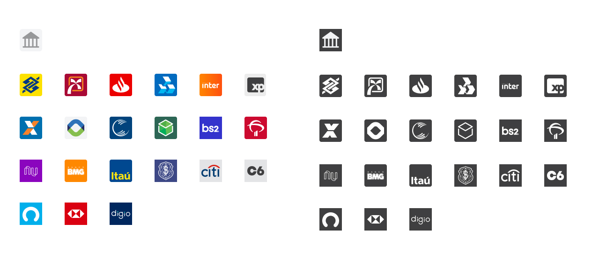

# react-br-bank-icons
[](https://coveralls.io/github/jonathasbsouza/react-br-bank-icons?branch=master)
[](https://travis-ci.org/jonathasbsouza/react-br-bank-icons)

> Iconpack with brands of brazilian banks enrolled in FEBRABAN.



We currently have about 150 banking institutions registered with FEBRABAN. The purpose of this library is to allow people working on banking platforms to be able to easily display the brand of these institutions when necessary.

### Content

1. [Demo](##1.-Demo)
2. [Installation](##2.-Installation)
3. [Usage](##3.-Usage)     
    [Props](###Props)     
    [Colors](###Colors)     
    [Fallback](###Fallback)     
4. [Known Issues](##4.-Known-Issues)
5. [Release History](##5.-Release-History)
6. [Contributing](##6.-Contributing)
7. [Meta](##7.-Meta)

## 1. Demo

### **Check it out [here](https://codesandbox.io/s/react-br-bank-icons-mwl81?file=/src/App.js)**

## 2. Installation

With NPM

```sh
npm install react-br-bank-icons --save
```


## 3. Usage

### Props

You can see the `name` and `bankId` of available icons in [ICONLIST.md](docs/ICONLIST.md). To see all banks enrolled in FEBRABAN, go to [BANKLIST.md](docs/BANKLIST.md).

You can define your icon size with the `size` prop. However, some logos don't behave well in small sizes, and we don't have any perspective in making smallsize-proof icons. Proceed with caution.

You can also define the **border radius** of the icon, with the `borderRadius` prop. The default value is `2`, and means a border-radius of `2px` in a icon with a size of `24px`.

### By bank name

```js
<BankIcon name="itau" size="24" />
```

### By bank ID

```js
<BankIcon bankId={341} size="24" />
```

### Colors

#### Brand colors

```js
<BankIcon name="itau" size="24" />
```

#### Mono

You can define a specific color for the icon, and the library will use a mono version of it. You can use:
-  **HEX colors**: `color="#F4F6F8"`
-  **Color names**: `color='red'`
-  **RGBa**: `color="rgba(244,22,234,3)"`

```js
<BankIcon color="##FF0000" name="itau" size="24" />
```

### Fallback

If no valid `bankName` or `bankId` is given, the component will render a generic bank icon. If you inform a `color`, the `fallBack` icon will be rendered with the informed color.


## 4. Known Issues
If you have any issues with this library, please open an issue.

- BANRISUL logo is a mess.

## 5. Release History

* 0.0.5
    * Extended docs with **Codesandbox** example
* 0.0.4
    * Add basic icons
    * Original and mono colors
    * `borderRadius` prop
    * `size` Prop
    * Basic docs
    * Fallback Icon
    * Tests
    * CI

## 6. Contributing

1. Fork it (<https://github.com/jonathasbsouza/react-br-bank-icons/fork>)
2. Create your feature branch (`git checkout -b feature/fooBar`)
3. Commit your changes (`git commit -am 'Add some fooBar'`)
4. Push to the branch (`git push origin feature/fooBar`)
5. Create a new Pull Request

## 7. Meta

Distributed under the GPL-3.0 license. See ``LICENSE`` for more information.

All brands' copyrights goes to their respective legal owners.

